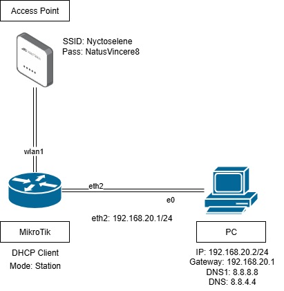

# Menghubungkan-Mikrotik-sebagai-Station-ke-Acces-Point

 

# Koneksi Mikrotik ke AP
⦁	Konfigurasi Security Wireless\
 Wireless > Security Profiles > + General\
 Name: Password\
 Ceklis semua Authentication Types, Unicast Chipers, Group Chipers\
 Pastikan WPA Pre-Shared Key dan WPA2 Pre-Shared Key sesuai dengan password Access Point\
 WPA Pre-Shared Key: NatusVincere8 WPA2 Pre-Shared Key: NatusVincere8\
 Apply > OK 

 

 
  
⦁	Konfigurasi interface wlan1\
 Wireless > Interfaces > enable WLAN dengan klik satu kali wlan1, lalu klik ceklis (✓) \
 klik dua kali wlan1\
 Tab Wireless\
 Mode: station

  

 Scan > Start\
 Klik kanan Access point yang akan dikoneksikan > Connect\
 Apply > OK

  


 Setelah itu akan ada notifikasi Error, kita close saja\
 Kembali ke Wireless > Interfaces > klik dua kali wlan1\
 Tab Wireless > Advanced Mode\
 Radio Name: RouterBoard-Belajar\
 Security profile: Password
 
 

⦁	DHCP Client untuk wlan1\
 IP > DHCP Client > + DHCP\
 Interface: wlan1\
 Apply > OK\
 IP > DHCP Client > wlan1 > status

  

⦁	Test koneksi Mikrotik ke Internet\
 Ketik ping ke alamat tujuan (contoh: ping google.com)\
 Ketik tools traceroute ke alamat tujuan (contoh: tools traceroute google.com)

 

# Mikrotik Sebagai Gateway
⦁	Konfigurasi NAT\
 IP > Firewall > NAT > +\
 General > Chain > srcnat\
 Out Interface: ether1-WAN\
 Action > Masquerade
 
 

⦁	Konfigurasi IP ether2\
 IP > Address > + Address = 192.168.20.1/24\
 Interface = ether2-LAN\
 Apply > OK
 
 

⦁	Konfigurasi IP Klien/Laptop\
 Start > Control Panel > Network and Internet > Network and Sharing Center\
 Change Adapter Setting > Network Connection\
 Klik kanan Local Area Connection > Properties > TCP/IPv4 > Properties\
 IP address: 192.168.20.2\
 Subnet mask: 255.255.255.0\
 Default gateway: 192.168.20.1\
 Prefered DNS server: 8.8.8.8\
 Secondary DNS server: 8.8.4.4

  

⦁	Test Koneksi Laptop ke Internet\
 Windows+R > ketik cmd lalu enter\
 Ketik ping ke alamat tujuan (contoh: ping google.com)\
 Ketik tracert ke alamat tujuan (contoh: tracert google.com)
 
# Kesimpulan
⦁	Mikrotik dapat digunakan juga sebagai station penghubung PC Klien/Laptop ke Access Point tanpa perlu menyambungkan kabel ke ISP\
⦁	Metode ini juga bisa menghemat ruang dengan mengurangi kabel yang terhubung supaya lebih terorganisir dan terlihat rapi

Sekian yang dapat saya sampaikan, mohon maaf apabila ada salah kata atau kekurangan dalam penyampaian. Akhir kata, Wassalam

